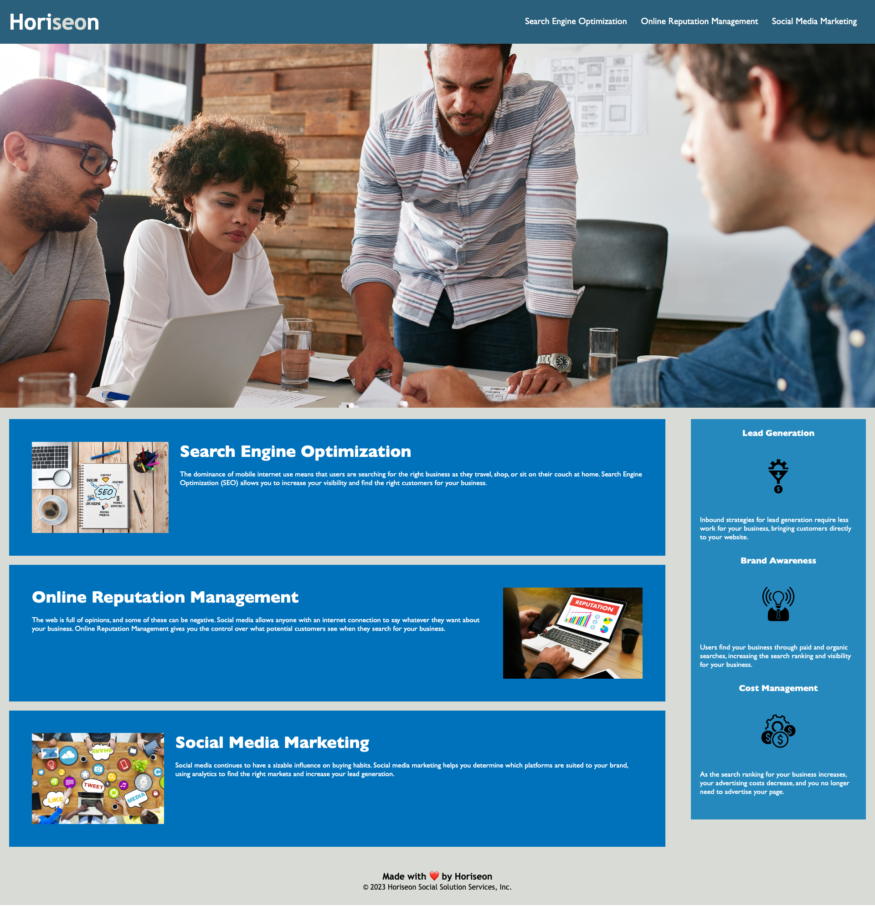

# Horiseon - Website Code Refactor

## Project Description
An increasingly important consideration for businesses, web **accessibility** ensures that people with disabilities can access a website using assistive technologies like video captions, screen readers, and braille keyboards. Accessibility is good for business&mdash;for one thing, accessible sites rank higher in search engines like Google. It also helps companies avoid litigation, which might arise if people with disabilities can't access a website.

The main goal of this project is to improve the existing code of the website to comply basic accessibility standards, without changing the functionality of the application.

## Code refactoring summary

### HTML
- Replaced divs with semantic elements
- Added alt description to the images
- Fixed a navbar bug, linking all the items to the right section on the page

### CSS
- Setted the navbar in a fixed position to fix it at the top of the page
- Replaced all classes with semantic elements
- Introduced a top margin to the hero class to avoid the sticky navbar to cover the hero image
- Increased the efficiency of the CSS by consolidating the selectors and properties, organizing them to follow the semantic structure of the HTML elements

## Mock-Up

The following image shows the web application's appearance and functionality:

> **Note**: This layout is designed for desktop viewing, so some of the elements don't look like the mock-up at a resolution smaller than 768px.

## Credits

- [Starter Code](https://github.com/coding-boot-camp/urban-octo-telegram)

## Repository and Webpage link

- [Repository Link](https://github.com/marphco/horiseon-code-refactor)
- [Webpage Link](https://marphco.github.io/horiseon-code-refactor/)